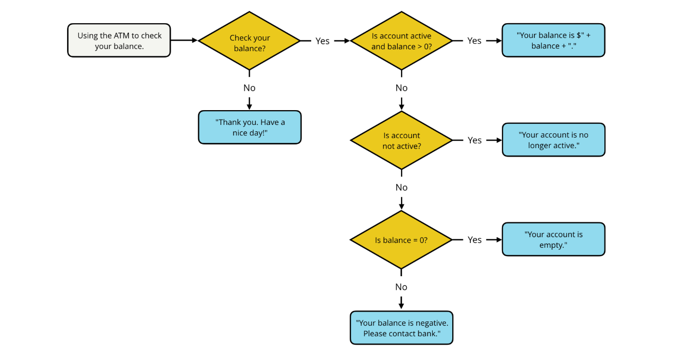

# Udacity js practice code

var tier = "nsfw deck";
var output = "You will receive "

switch (tier) {
  case "deck of legends":
    output += "a custom card, ";
    break; // Stops execution here
  case "collector's deck":
    output += "a signed version of the Exploding Kittens deck, ";
    break; // Stops execution here
  case "nsfw deck":
    output += "one copy of the NSFW (Not Safe for Work) Exploding Kittens card game.";
    break; // <--- The crucial addition to stop fall-through
  default:
    output += "one copy of the Exploding Kittens card game.";
    break; // Optional, but good practice
}

console.log(output);
// Prints: You will receive one copy of the NSFW (Not Safe for Work) Exploding Kittens card game.